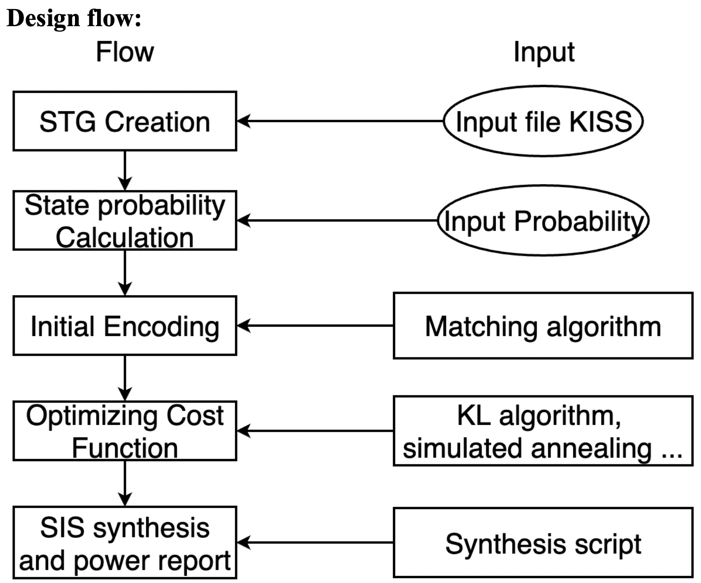
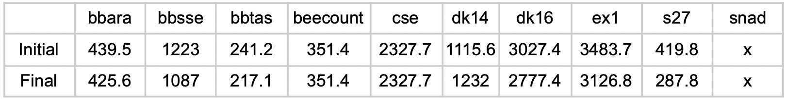

# Advanced-Logic-Synthesis
NTHU CS. 11120 CS613200 Advanced Logic Synthesis.

## Midterm project: Logic synthesis tool (ABC, SIS) analysis
- Evaluate and analyze logic synthesis tool, SIS and ABC
- SIS (A System for Sequential Circuit Synthesis) and ABC (A System for Sequential Synthesis and Verification) are used for synthesis and optimization of binary sequential logic circuits.
- Spec: [link](Midterm%20project/HW1_Spec.pdf)
- Report: [link](Midterm%20project/HW1_111062584.pdf)

## Hw2: Logic encryption algorithms evaluation
- Use SAT Attack to evaluate different logic encryption algorithms.
- Spec: [link](Hw2/HW2_Spec.pdf)
- Report: [link](Hw2/HW2_111062584.pdf)

## Final project: FSM State Assignment for Low Power Dissipation
- Minimize power consumption of a finite-state machine(FSM) in multilevel logic implementations.
- The project requires to develop an automatic design flow to encode a given FSM for power optimization.
- 
- 
- Spec: [link](Final_project/Final_project_spec.pdf)
- Report: [link](Final_project/Final_project_111062584.pdf)
